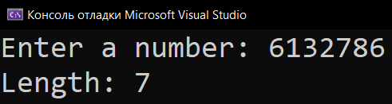
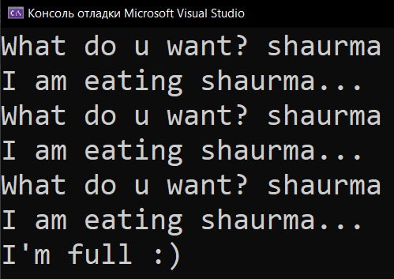

# Practice_9_Loop
Практика: Loop

<a href="https://gist.github.com/SlavikArt/998a59a8ec54194627adb8e1f1b47e51">Gist - страница со всеми кодами проектов</a>

* [Length_Of_A_Number](Length_Of_A_Number)
* [While_Loop](While_Loop)

    <h2>Length of a number</h2>
    
Length of a number

    
    <h2>While loop</h2>
    
While loop

    

